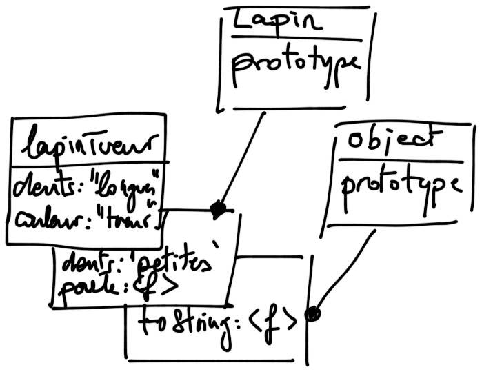
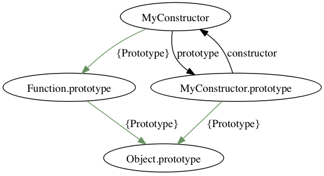

# JavaScript le mot clé this
---
C'est quoi un objet ?

Java vs Javascript

## Repartons d'ici
```javascript
    function create() {
      let reponse = 23;
      return function (x) { return x + reponse; }
    }

    let a = create()
    console.log(a(12))
```

### Scope implicite vs Objet
Le code suivant utilise plutôt un paradigme objet pour réaliser l'action.

```javascript
    function Create() {
      this.reponse = 23;
      this.calc = function (x) { return x + this.reponse; }
    }

    let a = new Create()
    console.log(a.calc(12))
```
Que fait l'opérateur new ?

### En Javascript, tout est objet !!!!
Q1 : Pouvez-vous le montrer ?

Un objet javascript est donc bien un ensemble de fonctions regroupé un 'contexte' d'exécution qui s'accède avec le mot clé this. Le contexte est fabriqué par l'opérateur new. L'ensemble des fonctions accessibles dans ce contexte forme le prototype de l'objet. Javascript est un langage Objet orientés prototypes. Un objet se définit par son contexte. Le contexte contient des attributs qui pour la majorité des cas sont des fonctions. Un nouveau contexte est fabriqué à partir d'un contexte initial. Il y a donc héritage des prototypes d'un objet.

Javascript a initialement choisi d'être minimaliste dans le nombre de mots-clés manipulant ces principes. Trois mots-clés ont été initialement proposés. new, this et bind.

new : s'applique sur une fonction et fabrique un nouveau contexte.
this : permet d'accéder au contexte d'une fonction.
bind : permet de manipuler le contexte d'une fonction.

Mais cette approche a été trop complexe à comprendre et moins strucuturante que pour Java. En effet dans l'approche Javascript, c'est l'invocation qui impose l'objet alors qu'en Java c'est la classe qui impose l'usage. En Java la structure impose le code, en javascript le code impose la structure.

Javascript s'est adapté récemment de deux manières. A votre avis comment faire ?

### Le sucre syntaxique
```javascript
class Machine {
  constructor() {
    this.utilite = 'rien'
  }
}

let machine = new Machine()
```

```coffeescript
class Animal
  constructor: (@name) ->

  move: (meters) ->
    alert @name + " moved #{meters}m."

class Snake extends Animal
  move: ->
    alert "Slithering..."
    super 5

class Horse extends Animal
  move: ->
    alert "Galloping..."
    super 45

sam = new Snake "Sammy the Python"
tom = new Horse "Tommy the Palomino"

sam.move()
tom.move()
```

Q2 : écrire le code coffeescript d'une classe simple. Pour cela il faut installer coffeescript avec votre utilitaire npm.
`npm install --global coffeescript`

## Quelques opérations de bas niveau
### bind permet de 'forcer' un contexte dans une fonction.
Soit le code suivant
```javacript
function parle() {
  console.log("->", this.me, " dis quelque chose")
}
```
Q3 : Fabriquez un objet autour de la fonction parle avec un contexte spécifique.
Q4 : Invoquez cet objet

### call et apply permettent de demander à l'interpréteur d'invoquer une fonction.

Soit la fonction suivante
```javascript
function parle(phrase) {
  console.log(this.me, " vous dit : ", phrase)

}
```
Q5 : invoquez la fonction parle en utilisant `call` et/ou `apply`.

** bind, call/apply sont des fonctions de bas niveau permettant de manipuler les éléments javascript. Elles doivent être vues comme des fonctions d'assemblage pour des langages de plus haut niveau.

## Ecriture de classe et héritage externe
Les trois écritures suivantes sont équivalentes
```JavaScript
let Machine1 = function() {
  return {
    utilite: "rien1",
    test: function () {console.log("coucou1", this.utilite);}
  }
}

let Machine2 = function() {
  this.utilite = "rien2";
  this.test = function() {console.log("coucou2", this.utilite)};
}

class Machine3 {
  constructor() {
    this.utilite = "rien3";
    this.test = function() {console.log("coucou3", this.utilite)};
  }
}

let machine1 = new Machine1(); machine1.test();
let machine2 = new Machine2(); machine2.test();
let machine3 = new Machine3(); machine3.test();
```
Q6: Relisez ce code pour bien comprendre la notion de sucre syntaxique.

Quand une méthode est résolue, javascript recherche cette méthode dans l'objet, dans le prototype de la classe, puis dans les prototypes hérités. L'attribut prototype d'une function/classe permet de manipuler cet héritage de manière extérieure (sans modifier le code source). Il s'agit encore d'une fonction de bas niveau.

Partons du code suivant :
```javascript
class Machine3 {
  constructor() {
    this.utilite = "rien3";
    this.test = function() {console.log("coucou3", this.utilite)};
  }
}

let machine3 = new Machine3();

//Vous ajouterez vos codes ici.

machine3.test();
```
On veut voir les mécanismes d'héritages de javascript. Insérez vos tests avant l'invocation pour comprendre le mécanisme d'héritage de js.

Q6.1 : Redéfinissez la fonction test de l'objet machine3, puis invoquez là.
Q6.2 : Redéfinissez le prototype de Machine3 en changeant test. Vérifiez alors que javascript est bien dynamique....
Q6.3 : Redéfinissez le prototype de Object en lui ajoutant une fonction test. Vérifiez alors que le mécanisme d'héritage de prototype fonctionne.

Q7 : vous devriez comprendre ce code.
```javascript

Number.prototype.parler = function() {
  console.log("Je suis un nombre !");
};

let nombre = 42;
nombre.parler();
```

### Fin de séance
## Passons aux objets (de l'objet !!)
Les objets en trois étapes

    let lapin = {};
    lapin.parle = function (phrase) {
      console.log("Le lapin dit '", phrase, "'");
    }
    lapin.parle("Je suis vivant.");

Mais aussi

    function parle (phrase) {
      console.log("Le lapin ", this.couleur, " dit '", phrase, "'");
    }
    let lapinBlanc = { couleur : "blanc", parle : parle };
    let lapinNoir = { couleur : "noir", parle : parle };

    lapinBlanc.parle(" Je suis tout blanc ");
    lapinNoir.parle(" Je suis tout noir ");


    lapin.parle(" je suis blanc ")
    ==
    parle.apply(lapin, ["je suis blanc"]);
    ==
    parle.call(lapin, "je suis blanc");


On peut appliquer l'opérateur new sur une fonction. Je vous suggère d'écrire cette fonction avec une première lettre en majuscule.

    function Lapin (couleur) {
      this.couleur = couleur;
      this.parle = function (phrase) {
        console.log("Le lapin ", this.couleur, " dit '", phrase, "'");
      };
    }

    let lapinTueur = new Lapin(" tueur ");
    lapinTueur.parle(" GRRRAAAAAAHHHH ");

    ------
    function fabriqueMoiUnLapin(couleur) {
      return {
        couleur: couleur,
        parle: function(phrase) { /***/ }
      };
    }
    let lapinNoir = fabriqueMoiUnLapin("black");

C'est ici qu'on découvre que javascript est un langage orienté prototype... Le prototype est un objet présent dans toutes les fonctions qui référence toute les fonctions disponibles à partir de celle-ci. Positionner une propriété n'affecte jamais le prototype. Rechercher une propriété se fait dans l'objet, puis dans le prototype, puis dans le prototype du prototype. Les prototypes sont chaînés.

     Lapin.prototype.dents = "petites";
     lapinTueur.dents;
     --> "petites"
     lapinTueur.dents = "longues et ascérées"
     lapinTueur.dents;
     --> "longues et ascérées";
     Lapin.prototype.dents;
     --> "petites";
     "longues et ascérées"




Voici un schema de départ de description d'une fonction.


```
MyConstructor = function () {
  this.a = "debut";
}
MyConstructor.protype.b = "fin";
let j = new MyConstructor();
console.log(j.a, j.b);
```


Ce que fait l'operateur new est donc :

1. Crée un nouvel objet (j). Le type de l'objet est object.
2. Positionne la propriété interne non accessible [[prototype]] vers la fonction pointée par le prototype de la function (MyConstructor.prototype).
3. Exécute le constructeur de ce prototype, en remplacant this par le nouvel objet créé (j) (j.a -> "debut")
4. Renvoie l'objet nouvellement créé, sauf si le constructeur retourne une valeur non primitive

Quand une propriété est recherchée, elle l'est dans l'objet puis dans tous les  prototypes enchainés.

Un dernier détail important sur le mot clé `this` représente l'objet qui 'possède' la fonction qui s'exécute.

```
let i = 30
function f () {
  let i = 15;
  console.log(i);
  console.log(this.i);
}
f()
```   
**L'exemple est clair ?**

## Quelques petits soucis sur le prototypage
Tous les objets possèdent des propriétés. Les leurs, celles des prototypes, et de la chaîne des prototypes.

Exemple 1

    let lesEtudiants = {};
    if ("constructor" in lesEtudiants) {
       console.log("Oui, il y a un étudiants qui s'appelle 'constructor'");
    }

Exemple 2 : Ecrire une fonction qui permet de lister les proprietés d'un objet.

    let test = {x:10, y:3};
    console.log(test.properties());

On est sauvé avec la methode hasOwnProperty qui permet de vérifier que la propriété est véhiculé par l'objet et non pas par son prototype.

On peut donc ecrire le programme fonctionnel suivant :

    function forEachIn(object, action) {
      for (let property in object) {
        if (object.hasOwnProperty(property))
          action(property, object[property]);
      }
    }

    let etudiants = {"sfrenot" : {nom: "frenot", prenom : "stephane", age : "22"},
                     "lmametz" : {nom: "mametz", prenom : "laurent"}};
    forEachIn(etudiants, function(name, value) {
      console.log("nom : ", name, " -> valeur ", value);
    });

**Que se passe t'il si un étudiant s'appelle 'hasOwnProperty' ?
Voyez-vous une solution ? (Changer d'ordre par exemple ...)**            

## Un dernier point sur la modularité et la notion d'interface de service

On veut faire un 'module' qui 'exporte' deux fonctions publiques de conversion.
Comment fonctionne ce programme ?

    function buildMonthNameModule() {
      let names = ["January", "February", "March", "April",
               "May", "June", "July", "August", "September",
               "October", "November", "December"];
      function getMonthName(number) {
        return names[number];
      }
      function getMonthNumber(name) {
        for (let number = 0; number < names.length; number++) {
          if (names[number] == name)
            return number;                    }
      }

      window.getMonthName = getMonthName;
      window.getMonthNumber = getMonthNumber;
    }

    buildMonthNameModule();

    show(getMonthName(11));

**Quels sont les problèmes de cette modularité ?**

1 Supprimer les déclarations multiples (chaque déclaration est source d'erreur de nom)

    function register(publicFunc) {
      forEachIn(publicFunc, function(name, value) {
         window[name] = value;
      });
    }

    function buildMonthNameModule() {
      let names = ["January", "February", "March", "April",
               "May", "June", "July", "August", "September",
               "October", "November", "December"];
      register ({
        getMonthName: function(number) {
          return names[number];
        },
        getMonthNumber: function(name) {
          for (let number = 0; number < names.length; number++) {
            if (names[number] == name)
              return number;
          }
        }
      });
     }   

     buildMonthNameModule();
     console.log(getMonthName(11));

2 Supprimer la fonction déclarée au top niveau
    En la rendant anonyme et en l'exécutant. Pour l'exécuter, il faut y mettre quelques parenthèses !!!

    (function() {
      let names = ["Sunday", "Monday", "Tuesday", "Wednesday",
               "Thursday", "Friday", "Saturday"];
      register({
        getDayName: function(number) {
          return names[number];
        },
        getDayNumber: function(name) {
          for (let number = 0; number < names.length; number++) {
            if (names[number] == name)
              return number;
          }
        }
      });
    })();

2.1 On peut enfin passer un paramètre externe à cette fonction... Ce code vous dit-il quelque chose ?

    (function() {
      let names = ["Sunday", "Monday", "Tuesday", "Wednesday",
               "Thursday", "Friday", "Saturday"];
      console.log(" $ -> ", $)
      register({
        getDayName: function(number) {
          return names[number];
        },
        getDayNumber: function(name) {
          for (let number = 0; number < names.length; number++) {
            if (names[number] == name)
              return number;
          }
        }
      });
    })($);             

Et voilà un beau module qui déclare deux fonctions publiques, en conservant les attributs privés (C'est ce qu'on cherche à faire en POO non ?)     


Pour se détendre [wat](https://www.destroyallsoftware.com/talks/wat)  
Linux dans javascript [bellard](http://bellard.org/jslinux/)  
Douglas Crockford, javascript leader [crockford](http://en.wikipedia.org/wiki/Douglas_Crockford)  
Description du new [stackOverflow](http://stackoverflow.com/questions/383402/is-javascript-s-new-keyword-considered-harmful)  
Description du this [stackOverflow](http://stackoverflow.com/questions/1646698/what-is-the-new-keyword-in-javascript)  
Dessin du this[schema this](http://zeekat.nl/articles/constructors-considered-mildly-confusing.html)  
Programmation fonctionelle [ruby](https://www.youtube.com/watch?v=FITJMJjASUs)
Statique ou dynamique [video](http://vimeo.com/74354480)

CT JS : [video](https://www.youtube.com/watch?v=PtD-WKSC6ak)

---
# Pourquoi faire du JavaScript ?
Javascript est certainement aujourd'hui le plus gros ecosystème numérique. Il va concerner les aspects communautaires suivants :

- Développement d'applications :   
  * n'importe qui peut développer en Javascript, et l'exécuter sans 'temps mort'.
  * Démarrer par les interfaces Web permet d'avoir un MVP[^1] tiré par l'usage (UX).
  * L'infrastructure nodejs[^2] permet d'envisager des développements logiciels monolangages de bout en bout. LinkedIn, NetFlix, Paypal
- Développement de plugins : (Nature fonctionnelle)
  * Les fonctions basiques sont développés de manière autonomes. Certains plugins sont maintenant incontournables :
    * jquery
    * underscore
    * bootstrap
  * Nombreux gestionnaires de bibliothèques : bower (client), npm (serveur), require, standardisation des modules
- Intégration dans tous les grands systèmes : facebook, linkedin
- Infrastructures de référence : angularjs, amberjs, phonegap, cordovajs,
- Runtime : os, nodejs, v8, navigateurs
  * Navigateurs Web : fixe, tablettes, smartphone
  * Machines virtuelles : v8, fantomjs
  * Systèmes d'exploitation
- Sur Langages : coffeescript, typescript

---
- Assembleur du web
- Jungle stimulante
- Approche modulaire/fonctionnelle, facile de développer
- Pas de 'spécialiste' de domaine précis
- Effet reseau (github)
- Normalisation ECMA  

---
- Le but n'est pas d'enseigner exclusivement JavaScript, mais d'être prêt sur le plus gros ecosystème connu.
- Menaces : dart, jungle complexe (mais vrai challenge), mauvais programmeur (mais c'est le cas dans tous les langages).


[^1]: Minimum Viable Product : Lean startup, E. Ries
[^2]: NodeJs : [http://nodejs.org](http://nodejs.org)
